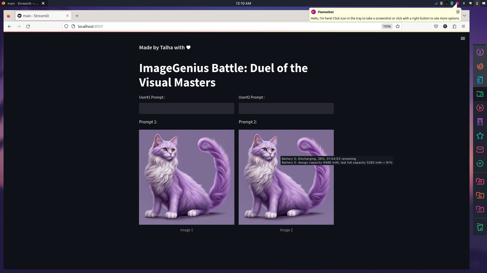

# ImageGenius Battle: Duel of the Visual Masters

## Project Screenshot


**Project Overview:**

ImageGenius Battle is a fun and interactive web application that allows users to compete in generating and comparing images side by side. Users can input prompts, and the application generates images based on those prompts for users to compare. The project is designed to showcase the capabilities of the Stable Diffusion image generation model.

**Project Structure:**

```bash
.
├── api_credentials.json # API credentials for image generation
├── images
│ └── purple_cat.jpg # Sample image for demonstration
├── main.py # Streamlit app code
├── purple_cat.jpg # Another sample image for demonstration
├── pycache
│ └── stable_diffusion.cpython-37.pyc
└── stable_diffusion.py # Image generation logic

```
**How to Run the Project:**

1. Clone the repository to your local machine:

```bash
  git clone https://github.com/cls-talha/image-generator-with-UI/tree/main
```

2. Install the required Python libraries:
```bash
   pip install streamlit pillow requests numpy opencv-python matplotlib
```
```bash
streamlit run main.py
```

5. Open your web browser and navigate to the URL provided by Streamlit (usually something like http://localhost:8501).

6. You can now use the web application to enter prompts, generate images, and compare them side by side.

**Project Features:**

- Users can input prompts for image generation.
- The application uses the Stable Diffusion image generation model to create images based on user prompts.
- Images are displayed side by side for easy comparison.
- Users can enjoy a friendly competition to see who generates better images based on the given prompts.

**Project Dependencies:**

- Streamlit: Web app framework for building interactive applications.
- Pillow: Image processing library for opening, manipulating, and saving images.
- Requests: HTTP library for making API requests.
- NumPy: Library for numerical computing.
- OpenCV: Computer vision library for image processing.
- Matplotlib: Library for creating visualizations in Python.

**Contributors:**


**Acknowledgments:**

- The Stable Diffusion image generation model used in this project is provided by [getimg.ai](https://getimg.ai/).

**License:**

I dont give a fuck about license

**Contact:**

For any questions or feedback, please contact [Your Email Address](mailto:hey.imtalha@gmail.com).


